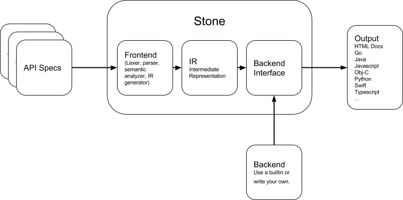

=====
Stone
=====

*Warning: The documentation is undergoing a rewrite.*

.. image:: https://travis-ci.org/dropbox/stone.svg?branch=master
    :target: https://travis-ci.org/dropbox/stone

Define an API once in Stone. Use backends, i.e. code generators, to translate
your specification into objects and functions in the programming languages of
your choice.

* Introduction
    * Motivation_
    * Installation_
* `Language Reference <https://github.com/dropbox/stone/blob/master/docs/lang_ref.rst>`_
* `Builtin Backends <https://github.com/dropbox/stone/blob/master/docs/builtin_backends.rst>`_
* `Managing Specs <https://github.com/dropbox/stone/blob/master/docs/managing_specs.rst>`_
* `Evolving a Spec <https://github.com/dropbox/stone/blob/master/docs/evolve_spec.rst>`_
* `Backend Reference <https://github.com/dropbox/stone/blob/master/docs/backend_ref.rst>`_
* `JSON Serializer <https://github.com/dropbox/stone/blob/master/docs/json_serializer.rst>`_
* `Network Protocol <https://github.com/dropbox/stone/blob/master/docs/network_protocol.rst>`_

Overview
========

Stone is made up of several components:

Language
--------

A language for writing API specifications, "specs" for short.

Command-Line Interface
----------------------

The CLI (``stone``) generates code based on the provided specs, backend,
and additional arguments.

Backends
--------

There are builtin backends that come with Stone: Javascript, Python, Obj-C,
Swift, and Typescript.

There are other backends we've written that aren't part of the Stone package
because they aren't sufficiently general, and can't realistically be re-used
for non-Dropbox APIs: Go and Java.

Stone includes a Python interface for defining new backends based on its
intermediate representation of specs. This gives you the freedom to generate
to any target.

JSON Serialization
------------------

Stone defines a JSON-compatible serialization scheme.

Motivation
==========

Stone was birthed at Dropbox at a time when it was becoming clear that API
development needed to be scaled beyond a single team. The company was
undergoing a large expansion in the number of product groups, and it wasn't
scalable for the API team, which traditionally dealt with core file operations,
to learn the intricacies of each product and build corresponding APIs.

Stone's chief goal is to decentralize API development and ownership at Dropbox.
To be successful, it needed to do several things:

**Decouple APIs from SDKS**: Dropbox has first-party clients for our mobile
apps, desktop client, and website. Each of these is implemented in a different
language. Moreover, we wanted to continue providing SDKs to third-parties, over
half of whom use our SDKs. It's untenable to ask product groups that build APIs
to also implement these endpoints in a half-dozen different language-specific
SDKs. Without decoupling, as was the case in our v1 API, the SDKs will
inevitably fall behind. Our solution is to have our SDKs automatically
generated.

**Improve Visibility into our APIs**: These days, APIs aren't just in the
domain of engineering. Product managers, product specialists, partnerships,
sales, and services groups all need to have clear and accurate specifications
of our APIs. After all, APIs define Dropbox's data models and functionality.
Before Stone, API design documents obseleted by changes during implementation
were the source of truth.

**Consistency and Predictability**: Consistency ranging from documentation
tense to API patterns are important for making an API predictable and therefore
easier to use. We needed an easy way to make and enforce patterns.

**JSON**: To make consumption easier for third parties, we wanted our data
types to map to JSON. For cases where serialization efficiency
(space and time) are important, you can try using msgpack (alpha support
available in the Python generator). It's possible also to define your own
serialization scheme, but at that point, you may consider using something like
`Protobuf <https://github.com/google/protobuf>`_.

Stone is in active use for the `Dropbox v2 API
<http://www.dropbox.com/developers>`_.

Assumptions
-----------

Stone makes no assumptions about the protocol layer being used to make API
requests and return responses; its first use case is the Dropbox v2 API which
operates over HTTP. Stone does not come with nor enforce any particular RPC
framework.

Stone makes some assumptions about the data types supported in target
programming languages. It's assumed that there is a capacity for representing
dictionaries (unordered string keys -> value), lists, numeric types, and
strings.

Stone assumes that a route (or API endpoint) can have its argument and
result types defined without relation to each other. In other words, the
type of response does not change based on the input to the endpoint. An
exception to this rule is afforded for error responses.

Installation
============

Install stone using ``pip``::

    $ pip install --user stone

This will install a script ``stone`` to your PATH that can be run from the
command line::

    $ stone -h

Alternative
-----------

If you choose not to install ``stone`` using the method above, you will need
to ensure that you have the Python packages ``ply`` and ``six``, which can be
installed through ``pip``::

    $ pip install "ply>=3.4" "six>=1.3.0" "typing>=3.5.2"

If the ``stone`` package is in your PYTHONPATH, you can replace ``stone``
with ``python -m stone.cli`` as follows::

    $ python -m stone.cli -h

If you have the ``stone`` package on your machine, but did not install it or
add its location to your PYTHONPATH, you can use the following::

    $ PYTHONPATH=path/to/stone python -m stone.cli -h
